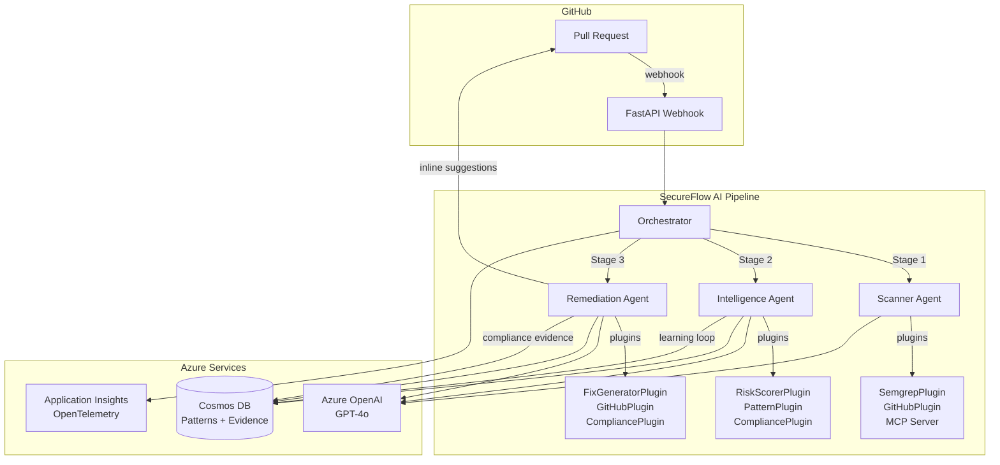

# SecureFlow AI

**AI-Powered Multi-Agent DevSecOps Intelligence Platform**

> Transform security noise into actionable intelligence. SecureFlow AI uses a 3-agent pipeline to detect vulnerabilities in pull requests, prioritize them by real-world risk, and generate validated fixes that developers can apply with one click.

---

## The Problem

Modern development teams face three critical security challenges:

1. **Alert Fatigue** — SAST tools generate 50-200+ findings per scan. Most are noise. Security teams spend hours triaging while critical vulnerabilities slip through.
2. **Context-Free Fixes** — Generic recommendations like "use parameterized queries" don't account for team frameworks, coding patterns, or business context.
3. **Compliance Theater** — Manual mapping of vulnerabilities to SOC2/PCI-DSS/OWASP requirements creates audit busywork that doesn't improve security.

## The Solution

SecureFlow AI is an **autonomous security review pipeline** that processes every pull request through three specialized AI agents:

```
PR Opened → Scanner Agent → Intelligence Agent → Remediation Agent → PR Comments
                |                   |                    |
            Detect vulns      Prioritize by risk    Generate fixes
            (Semgrep SAST)    (multi-factor score)  (confidence routing)
                                    |                    |
                              Filter noise          Post inline suggestions
                              Enrich context        Create compliance evidence
```

### Confidence-Based Fix Routing

| Confidence | Action | Developer Experience |
|-----------|--------|---------------------|
| **≥ 90%** | Auto-suggest inline on PR | Click "Commit suggestion" to apply |
| **70-89%** | Suggest with `[Review Required]` tag | Review diff, then commit |
| **< 70%** | Escalate to security team | GitHub issue created automatically |

## Architecture



### Agent Architecture

| Agent | Role | Plugins | Output |
|-------|------|---------|--------|
| **Scanner** | Detect vulnerabilities via SAST | Semgrep, GitHub (diff/files), MCP | Structured findings JSON |
| **Intelligence** | Prioritize, filter noise, enrich context | Risk Scorer, Pattern DB, Compliance Mapper | Top 3-5 critical findings |
| **Remediation** | Generate fixes, validate, route by confidence | Fix Generator, GitHub (PR Review), Compliance Evidence | Inline suggestions + evidence docs |

## Tech Stack

| Layer | Technology |
|-------|-----------|
| **Agent Framework** | [Semantic Kernel Python v1.39+](https://github.com/microsoft/semantic-kernel) — `ChatCompletionAgent`, `SequentialOrchestration` |
| **LLM** | Azure OpenAI GPT-4o (via AI Foundry) |
| **SAST Engine** | [Semgrep](https://semgrep.dev/) — static analysis with 2,000+ rules |
| **Knowledge Base** | Azure Cosmos DB NoSQL — fix patterns, compliance evidence |
| **Observability** | OpenTelemetry + Azure Application Insights |
| **Webhook** | FastAPI + uvicorn (async, production-grade) |
| **MCP Integration** | GitHub MCP Server (`@modelcontextprotocol/server-github`) |
| **Deployment** | Azure Container Apps (auto-scaling, HTTPS ingress) |
| **Dashboard** | Streamlit + Plotly |

## Key Features

- **Multi-Agent Pipeline** — 3 specialized agents with `@kernel_function` plugins, orchestrated via SK `SequentialOrchestration` with manual chaining fallback
- **Confidence-Based Routing** — Fixes auto-applied, flagged for review, or escalated based on heuristic confidence scoring
- **Knowledge Base Learning Loop** — Fix patterns improve over time based on developer acceptance/rejection (Cosmos DB with ETag concurrency)
- **Compliance Evidence** — Automatic CWE→SOC2/PCI-DSS/OWASP/HIPAA mapping with audit-ready evidence documents
- **MCP Integration** — GitHub MCP server provides agents with extended repository capabilities
- **Circuit Breaker** — Each pipeline stage can fail independently; partial results are still posted
- **Distributed Tracing** — OpenTelemetry spans for every agent step, exportable to Application Insights
- **Rate Limiting** — Semaphore-based concurrent analysis cap prevents resource exhaustion

## Quick Start

### Prerequisites

- Python 3.12+
- Azure OpenAI resource with GPT-4o deployment
- Azure Cosmos DB (free tier works)
- GitHub Personal Access Token
- Semgrep CLI (`pip install semgrep`)
- Node.js 20+ (for MCP server)

### Setup

```bash
# Clone and install
git clone https://github.com/your-org/secureflow-ai.git
cd secureflow-ai
pip install -e ".[dev]"

# Configure environment
cp .env.example .env
# Edit .env with your Azure and GitHub credentials

# Run locally
uvicorn src.main:app --reload --port 8000

# Expose for GitHub webhooks (development)
ngrok http 8000

# Run dashboard (optional)
streamlit run dashboard/app.py
```

### Deploy to Azure

```bash
# One-command deployment to Azure Container Apps
chmod +x infra/deploy.sh
./infra/deploy.sh

# Then set secrets (see script output for exact command)
```

## Project Structure

```
src/
├── main.py                  # FastAPI webhook + pipeline trigger + learning loop
├── orchestrator.py          # 3-agent orchestration (sequential + manual fallback)
├── config.py                # Pydantic BaseSettings
├── models.py                # Data contracts (Finding, Fix, RiskScore, Evidence)
├── telemetry.py             # OpenTelemetry + Azure Monitor
├── agents/
│   ├── scanner.py           # Stage 1: SAST vulnerability detection
│   ├── intelligence.py      # Stage 2: Risk scoring + context enrichment
│   └── remediation.py       # Stage 3: Fix generation + confidence routing
└── plugins/
    ├── semgrep_plugin.py    # Semgrep + Trivy SAST scanning
    ├── github_plugin.py     # GitHub PR API (diff, review, suggestions)
    ├── risk_plugin.py       # Multi-factor risk scoring algorithm
    ├── pattern_plugin.py    # Knowledge base (Cosmos DB patterns)
    ├── fix_plugin.py        # Fix generation + AST validation
    ├── compliance_plugin.py # CWE→compliance mapping + evidence
    └── mcp_plugin.py        # GitHub MCP server integration
```

## Hackathon Category Alignment

This project was built for the **Microsoft AI Dev Days Hackathon** and addresses all five judging criteria:

| Criterion (20% each) | How SecureFlow AI Delivers |
|----------------------|---------------------------|
| **Technological Implementation** | Production-grade Python with async patterns, Pydantic validation, OpenTelemetry, Docker multi-stage builds, proper error handling |
| **Agentic Design & Innovation** | 3-agent sequential pipeline with confidence-based routing, circuit breaker, knowledge base learning loop, MCP integration |
| **Real-World Impact** | Solves alert fatigue (50+ findings → top 5), generates one-click fixes, automates compliance evidence for SOC2/PCI-DSS audits |
| **UX & Presentation** | Inline PR suggestions ("Commit suggestion" button), severity badges, compliance impact section, Streamlit dashboard |
| **Adherence to Hackathon Category** | Semantic Kernel `ChatCompletionAgent` + `SequentialOrchestration`, Azure OpenAI, Cosmos DB, Application Insights, MCP servers |

## License

MIT

---

Built with [Semantic Kernel](https://github.com/microsoft/semantic-kernel) | Powered by [Azure OpenAI](https://azure.microsoft.com/en-us/products/ai-services/openai-service)
